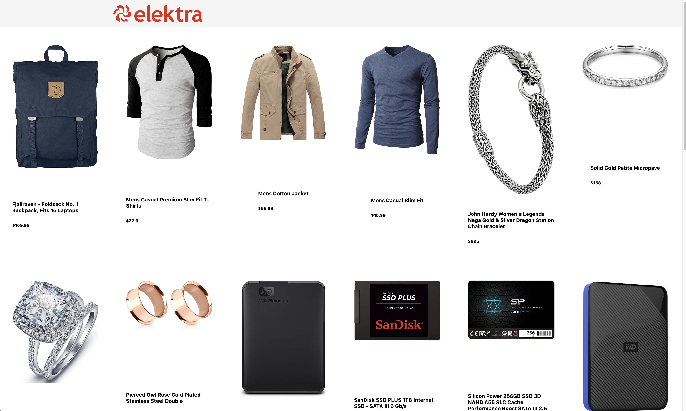
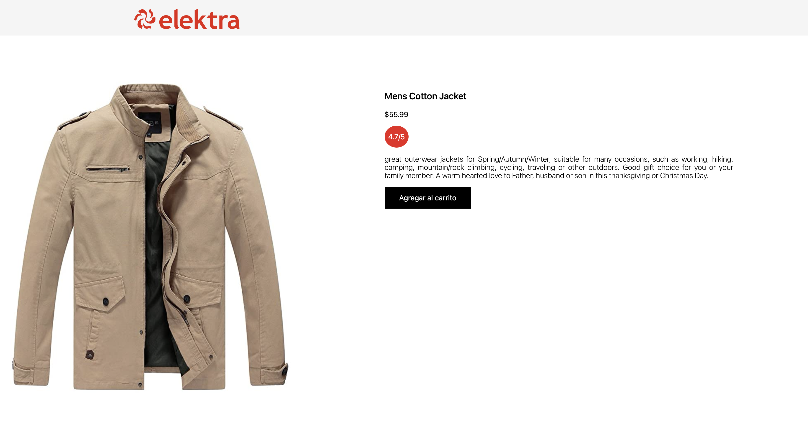

# Interview Challenge

A short description about the project and/or client.

Project interview challenge, implement two e-commerce like pages, one with a list of products and another one with a product's detail

## Getting Started

These instructions will get you a copy of the project up and running on your local machine for development and testing purposes. See deployment for notes on how to deploy the project on a live system.

### Prerequisites
* npx *or* npm *or* yarn installed

### Installation
Execute one of the followinf commands:
```
$ npm install next react react-dom
  # or
$yarn add next react react-dom
  # or
$ pnpm add next react react-dom
```

## Usage
Execute one of the followinf commands:
```
$ npm run dev
  # or
$yarn run dev
  # or
$ pnpm run dev
```
Visit http://localhost:3000 to view your application

### Structure
Principal application's components
* ProductsPage: Shows a list of all products requested to [fakestore site](https://fakestoreapi.com)
* ProductPage: Shows a specific product's details

```
[
    {
        id:1,
        title:'...',
        price:'...',
        category:'...',
        description:'...',
        image:'...'
    },
    /*...*/
]
```
### Pages 
  
  

